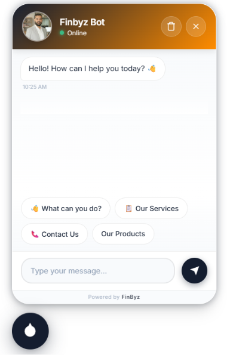

# Chatforge

Chatforge is an enterprise-grade, multi-tenant Chatbot Software-as-a-Service (SaaS) platform built natively on Frappe and ERPNext. It operates as an orchestration and deployment layer on top of [FinByz AI](https://github.com/finbyz/finbyzai), enabling agencies, developers, and businesses to deploy intelligent, context-aware AI chatbots across multiple external websites with zero coding required.

By combining autonomous agents, dynamic prompt engineering, and automated sitemap scraping, Chatforge turns the complex infrastructure of LLMs and Vector Databases into a seamless, 1-click deployment experience.



## Table of Contents

- [Introduction](#introduction)
- [Core Capabilities](#core-capabilities)
- [Architecture Overview](#architecture-overview)
- [Installation](#installation)
- [Configuration Guide](#configuration-guide)
  - [1. Creating a Chatbot Instance](#1-creating-a-chatbot-instance)
  - [2. Sitemap Integration & Knowledge Base Setup](#2-sitemap-integration--knowledge-base-setup)
  - [3. Agent Customization](#3-agent-customization)
- [Deploying the Widget](#deploying-the-widget)
- [Built-in AI Tools](#built-in-ai-tools)
- [Contributing](#contributing)
- [License](#license)

## Introduction

Deploying RAG-based (Retrieval-Augmented Generation) chatbots usually requires complex backend infrastructure to handle document chunking, vector embeddings, conversational memory, and frontend widget deployment. 

Chatforge abstracts all of this into standard Frappe Doctypes. You provide a target website URL, and Chatforge will dynamically generate a highly optimized system prompt, parse the website's sitemap, sync the content into a Vector Store, and generate a secure Javascript embed code for deployment.

## Core Capabilities

- **Multi-Tenant SaaS Infrastructure**: Serve hundreds of unique chatbots for different clients from a single Frappe instance. Each bot operates in isolation with its own API token, Knowledge Base, and Agent configuration.
- **Automated Prompt Engineering**: Utilizes a meta-agent ("Chatbot Prompt Generator") to dynamically craft tailored system prompts based on the client's business name and domain.
- **1-Click Sitemap Integration**: Input a sitemap XML URL, and Chatforge automatically parses the directory tree, allowing you to selectively sync specific pages into the chatbot's Knowledge Base.
- **Smart Lead Generation**: Agents are strictly instructed to prioritize answering user queries first using RAG, followed by a natural, conversational collection of lead data (Name, Email, Company).
- **No-Code Widget Embedding**: Generates a lightweight, highly customizable `<script>` and `<link>` tag combination that works on WordPress, Shopify, Next.js, or any standard HTML site.
- **Deep FinByz AI Integration**: Leverages all the power of `finbyzai`, including LiteLLM support for 100+ models, native vector store adapters (Pinecone, Qdrant, Chroma), and LangChain integrations.

## Architecture Overview

Chatforge extends the Frappe ecosystem with the following core components:

- **Chatbot Settings**: The central hub for a tenant's chatbot. Manages the bot's name, brand colors, API tokens, and tracks the sync status of sitemap URLs.
- **Orchestration Layer**: Upon saving a Chatbot Settings record, the backend automatically scaffolds the required `AI Agent` and `Knowledge Base` records in the `finbyzai` app.
- **Widget Controller**: Serves the `saas_widget.js` and securely handles incoming chat requests via cross-origin resource sharing (CORS), validating them against the generated API tokens and allowed domains.

## Installation

### Prerequisites
Chatforge strictly requires **FinByz AI** to function. Ensure `finbyzai` is installed and properly configured on your bench first.

### Setup

```bash
cd $PATH_TO_YOUR_BENCH

# Fetch the application from the repository
bench get-app https://github.com/finbyz/chatforge.git --branch develop

# Install the application on your target site
bench --site [your-site-name] install-app chatforge
```

## Configuration Guide

### 1. Creating a Chatbot Instance

1. Navigate to **Chatbot Settings** in your Frappe Desk.
2. Click **Add Chatbot Settings**.
3. Define the **Bot Name** and the client's **Website URL**.
4. Set the **Primary Color** to match the client's brand identity.
5. Define the **Allowed Domains** to prevent unauthorized usage of the embed widget on external sites.
6. **Save**. 

Upon saving, Chatforge will automatically generate an API Token, scaffold a tailored AI Agent, and prepare an empty Knowledge Base.

### 2. Sitemap Integration & Knowledge Base Setup

To give your chatbot context about the business, you must populate its Knowledge Base.

1. Inside the saved **Chatbot Settings** document, scroll to the Sitemap section.
2. Enter the target website's `sitemap.xml` URL.
3. Click **Fetch Sitemap**. Chatforge will parse the XML tree (including nested sitemap indexes) and populate the child table with discovered URLs.
4. Select the URLs you wish to sync, and click **Process Selected URLs**.
5. Chatforge will enqueue background jobs to scrape the content, split the text, generate embeddings, and upsert them to the configured Vector Store.

### 3. Agent Customization

If the auto-generated system prompt needs tweaking:

1. Click on the dynamically generated **AI Agent** link within the Chatbot Settings.
2. Modify the **System Message** to adjust the bot's persona, strictness, or lead generation flow.
3. Attach additional **AI Tools** if the bot requires external execution capabilities.

## Deploying the Widget

Once the Knowledge Base is synced and the agent is tested:

1. Open your **Chatbot Settings** record.
2. Locate the **Embed Code** section (accessible via the `Get Embed Code` action).
3. Copy the generated HTML snippet.
4. Paste the snippet just before the closing `</body>` tag of your target website.

The embed code ensures that all UI assets are loaded asynchronously without impacting the host website's core web vitals.

## Built-in AI Tools

Chatforge comes pre-packaged with specialized, autonomous tools designed for lead capture and dynamic scraping:

- **Create Chatbot Lead**: Automatically pushes collected conversational data (Name, Email) into your Frappe CRM as a standard Lead record.
- **Extract content from url**: Grants the agent the ability to scrape and read live web pages on-demand to answer queries regarding highly dynamic content not yet synced to the vector store.

## Contributing

This app uses `pre-commit` for code formatting and linting. We welcome pull requests that adhere to the standard Frappe development guidelines.

```bash
cd apps/chatforge
pre-commit install
```

Pre-commit is configured to use the following tools for checking and formatting your code:
- `ruff`
- `eslint`
- `prettier`
- `pyupgrade`

## License

This project is licensed under the **GPL-3.0** License.
